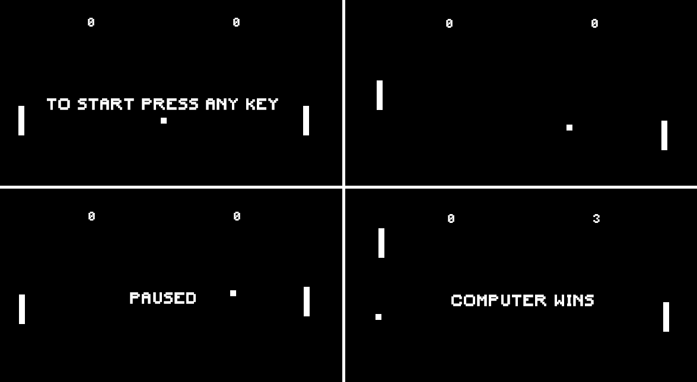

# Pong

Pong is a table tennis sports game featuring simple two-dimensional graphics, manufactured by Atari and originally released in 1972.



### Installing

Clone Git repository

```
git clone https://github.com/ekalksma/pong.git
```

Open public/index.html in your browser.

## License

This project is licensed under the [MIT License](./LICENSE).
